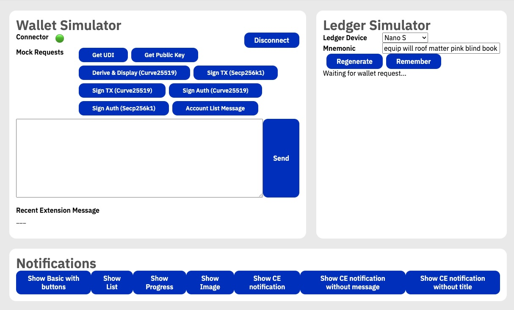

# Connector Extension Developer Tools

> [!IMPORTANT]  
> This module & UI was developed before ledger and wallet implementations were ready and not updated since. Be mindful when using it. Consider using real Radix Wallet and real ledger device with Radix Babylon app installed for e2e testing.

The Connector Extension includes a comprehensive set of developer tools to help test and debug wallet interactions. These tools are available in a dedicated browser tab and provide simulators for various components of the system. They're only available locally when build with `npm run build:dev`

In order to open dev tools, load CE from your local `dist` folder. Pin installed extension, then right click and select "Radix Dev Tools"

## Overview

The dev tools consist of three main components:
1. Wallet Simulator
2. Ledger Simulator
3. Notifications Simulator

## Wallet Simulator

The Wallet Simulator provides a WebRTC client that acts as a mock Radix Wallet, allowing you to test wallet-extension communication without needing the actual wallet application.

### Features

- **WebRTC Connection Management**
  - Real-time connection status indicator (🟢 connected, 🔴 disconnected) -> click first to init connection with connector extension
  - Automatic configuration based on extension settings

- **Pre-built Mock Requests**
  - Get UDI (Unique Device Identifier)
  - Get Public Key
  - Derive & Display (Curve25519)
  - Sign Transaction (Secp256k1)
  - Sign Transaction (Curve25519)
  - Sign Auth Challenge (Curve25519)
  - Sign Auth Challenge (Secp256k1)
  - Account List Message

- **Message Testing**
  - Manual message composition area
  - Real-time message response display
  - JSON formatting for better readability

## Ledger Simulator

The Ledger Simulator allows testing of hardware wallet interactions without requiring a physical Ledger device.

### Features

- **Device Selection**
  - Supports Nano S, Nano S Plus, and Nano X models
  - Configurable device responses

- **Key Management**
  - Custom mnemonic input/generation
  - Support for both Curve25519 and Secp256k1
  - Ability to save and recall mnemonics for testing

- **Request Handling**
  - Automatic parsing of incoming Ledger requests
  - Mock response generation
  - Support for Ledger operation types:
    - Device ID requests
    - Public key derivation
    - Transaction signing
    - Challenge signing

## Notifications Simulator

The Notifications Simulator helps test various Chrome notification types supported by the extension.

### Features

- **Notification Types**
  - Basic notifications with buttons
  - Progress notifications
  - List notifications
  - Image notifications
  - Extension-specific notifications

- **Customization Options**
  - Title and message configuration
  - Custom icons and images
  - Progress indicators
  - Button actions

## Usage

1. To test wallet communication:
   - Connect the WebRTC client using the "Connect" button
   - Either use pre-built mock requests or compose custom messages
   - Monitor responses in the message log

2. To test Ledger interactions:
   - Select desired device model
   - Configure mnemonic (use default, generate new, or input custom)
   - Wait for incoming Ledger requests
   - Use "Mock Respond" to simulate device responses

3. To test notifications:
   - Select notification type
   - Click corresponding button to trigger notification
   - Observe notification appearance and behavior

## Development Notes

- The WebRTC client runs in a browser tab and simulates the wallet's behavior
- All simulated components respect the extension's configuration settings
- Saved mnemonics are stored in local storage for persistence