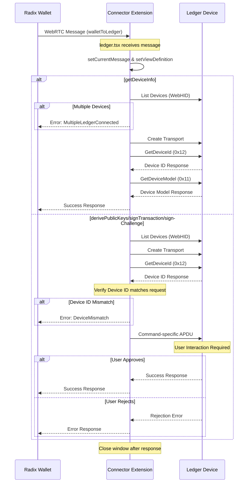

# Ledger

See [Ledger App implementation](https://github.com/LedgerHQ/app-radix-babylon) 

## Overview

The Ledger module enables the Connector Extension to interact with Ledger hardware wallets running the Radix Babylon app. It provides functionality for:

- Connecting to Ledger devices via WebHID
- Deriving public keys and addresses
- Signing transactions, auth challenges and subintents
- Managing device connections and state

## Full list of supported commands

```
GetDeviceModel: '11',
GetDeviceId: '12',
GetAppSettingsId: '20',
GetPubKeyEd25519: '21',
GetPubKeySecp256k1: '31',
SignTxEd25519: '41',
SignTxSecp256k1: '51',
SignAuthEd25519: '61',
SignAuthSecp256k1: '71',
DeriveAndDisplayAddressEd25519: '81',
DeriveAndDisplayAddressSecp256k1: '91',
SignPreAuthHashEd25519: 'A1',
SignPreAuthHashSecp256k1: 'A2',
```

## Connection Flow

1. User initiates Ledger connection through the Radix Wallet
2. Extension requests WebHID access to the device
3. Once connected, the extension verifies:
   - Device is unlocked
   - Radix Babylon app is open
   - App version is compatible
   - Device ID are compatible

## Usage Requirements

- Chrome browser with WebHID support
- Ledger device (Nano S, Nano S Plus, or Nano X)
- Radix Babylon app installed on device
- Device must be unlocked with Radix app open

## Error Handling

The module implements error handling for various scenarios:

- Connection failures
- Device locked/disconnected
- Wrong app open
- User rejection
- Communication errors
- Invalid data formats

Some errors returned from the physical device are caught by the Connector Extension and not sent back to the wallet. These specific error codes are listed in `LedgerErrorCode`, which includes scenarios such as when the device is locked or when the wrong app is opened. However, if a user explicitly dismisses a transaction on the Ledger device, this error must be sent back to the wallet.

## Diagram



**This sequence diagram shows:**

* Initial WebRTC message from Radix Wallet to Connector Extension
* Message handling in the Connector Extension's ledger.tsx component
* Device communication through WebHID:
  * Device listing and transport creation
  * Device ID verification 
  * Command-specific communication
* Error handling for various scenarios:
  * Multiple connected devices
  * Device ID mismatch
  * User rejection
* Response flow back to the Radix Wallet


The communication uses APDU (Application Protocol Data Unit) commands as defined in the Ledger app implementation, with specific instruction codes for each operation (e.g., 0x12 for GetDeviceId, 0x11 for GetDeviceModel).

A complete list of errors is available in the [babylon-ledger-app repository](https://github.com/radixdlt/babylon-ledger-app/blob/c70cb8d29aa74822c020b53cd64b0137f30c02d2/src/app_error.rs#L29).
