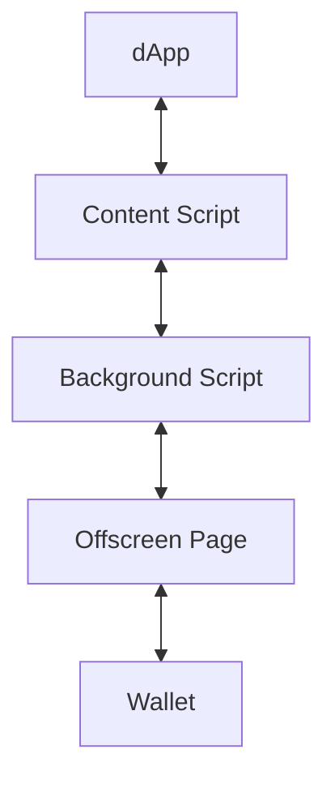
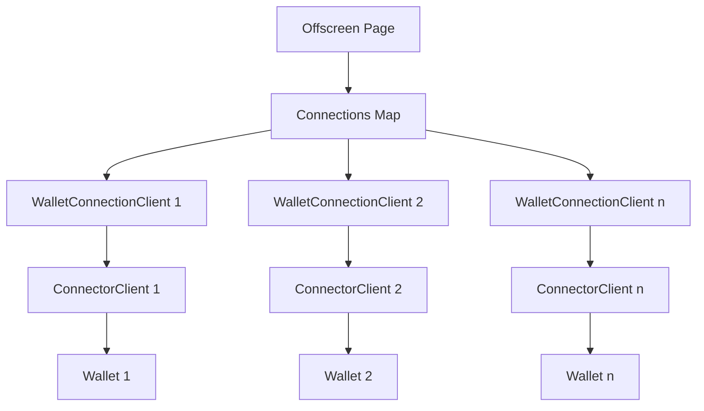
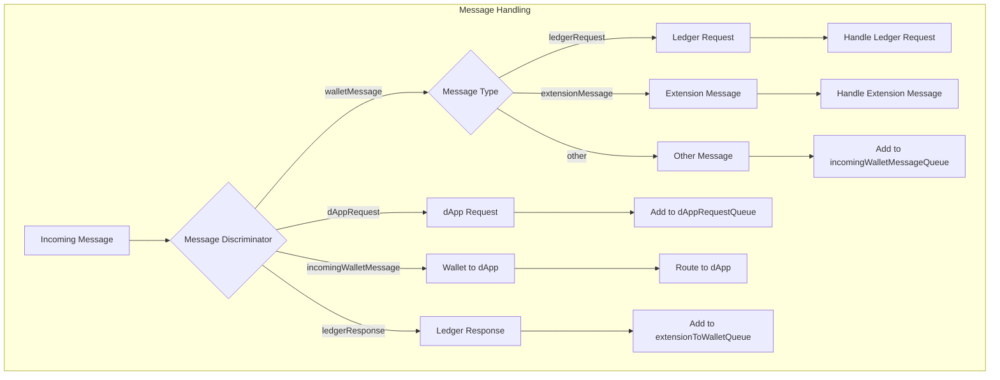
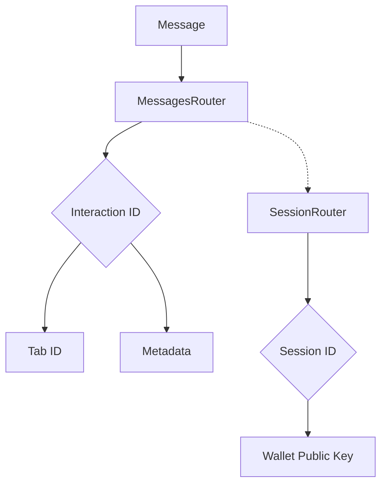
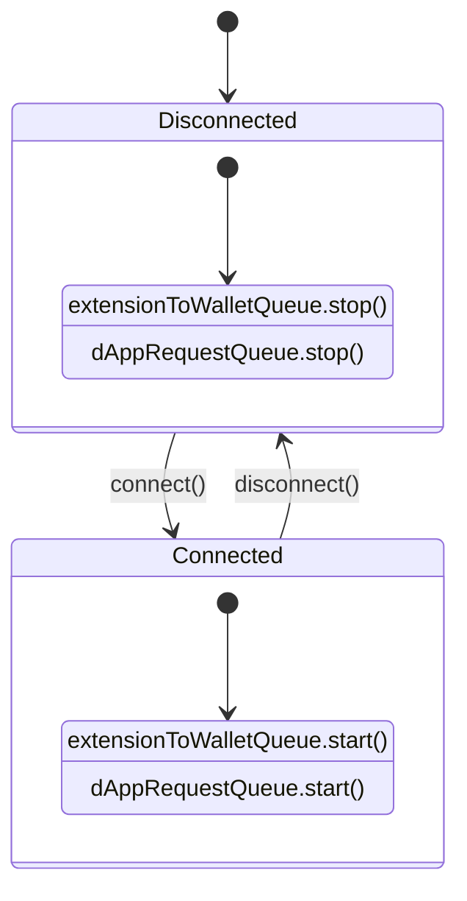
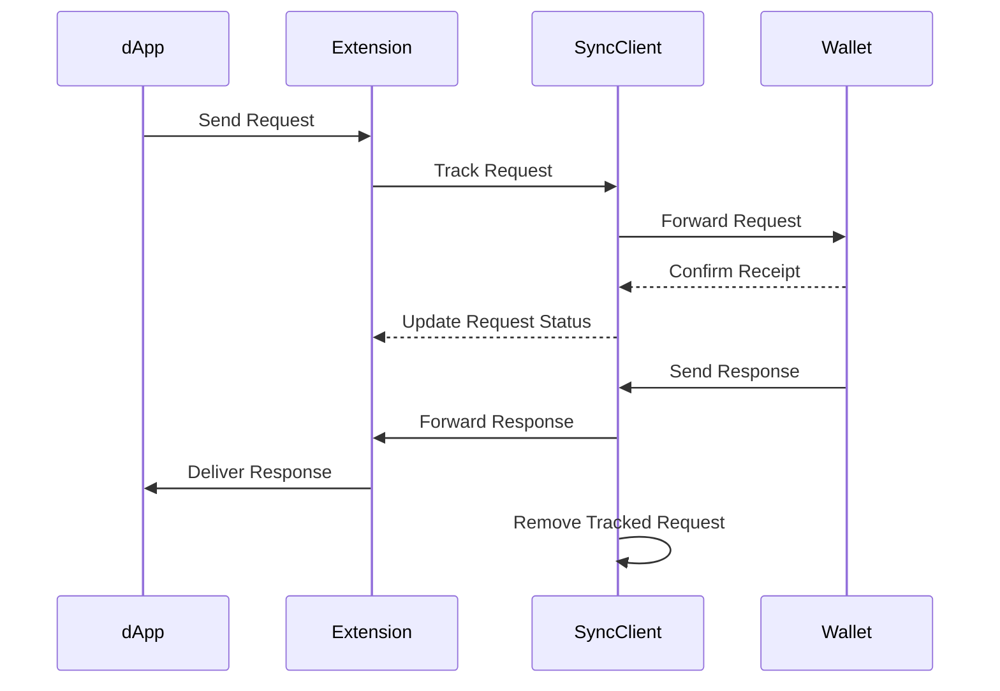
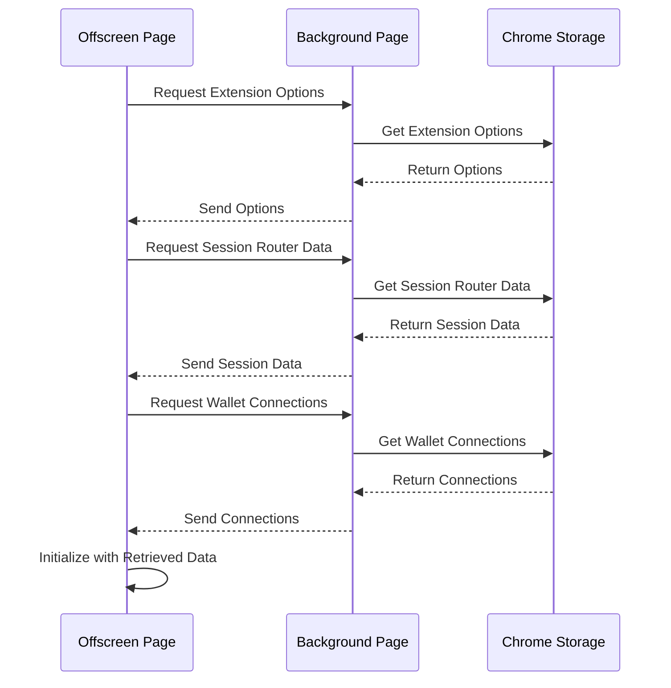
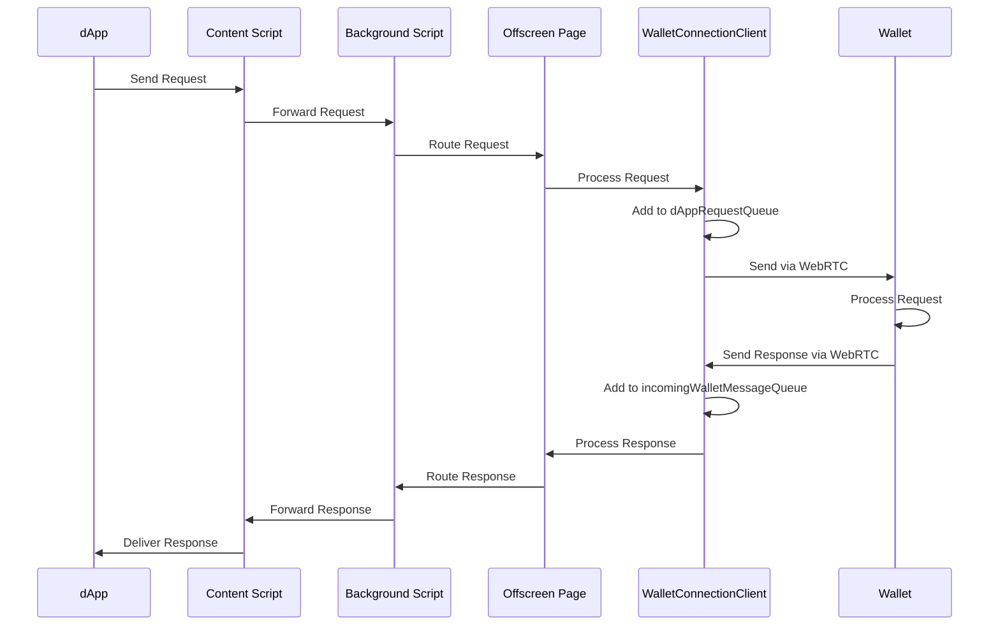

# Offscreen Page Communication with Wallet

This document explains how the offscreen page communicates with the wallet in the connector extension.

## Architecture Overview

The offscreen page maintains connections with wallets and handles message routing between dApps, the extension, and wallets. It uses WebRTC for real-time communication with wallets through the `ConnectorClient`.

### High-Level Architecture Diagram



## Connection Setup

- The offscreen page maintains a [`WalletConnectionClient`](../src/chrome/offscreen/wallet-connection/wallet-connection-client.ts) for each connected wallet, stored in a `connectionsMap`.
- Each `WalletConnectionClient` uses WebRTC for real-time communication with the wallet through the `ConnectorClient`.
- The main offscreen page setup is defined in [`offscreen.ts`](../src/chrome/offscreen/offscreen.ts).

### Connection Setup Diagram



## Message Flow Architecture

The communication is handled through several queues:

- `dAppRequestQueue`: Handles messages from dApps to the wallet
- `extensionToWalletQueue`: Handles messages from the extension to the wallet
- `incomingWalletMessageQueue`: Handles incoming messages from the wallet

These queues are defined in the [`WalletConnectionClient`](../src/chrome/offscreen/wallet-connection/wallet-connection-client.ts).


## Message Types and Handling

The [`WalletConnectionMessageHandler`](../src/chrome/offscreen/wallet-connection/message-handler.ts) processes different types of messages:

### Wallet to Extension Messages

```typescript
case messageDiscriminator.walletMessage: {
  if (isLedgerRequest(message.data)) {
    // Handle ledger requests
  } else if (isExtensionMessage(message.data)) {
    // Handle extension-specific messages (accountList, linkClient)
  } else {
    // Handle other wallet messages
    incomingWalletMessageQueue.add(message.data, message.data.interactionId)
  }
}
```

### dApp to Wallet Messages

```typescript
case messageDiscriminator.walletInteraction: {
  // Route messages and add to dApp request queue
  return dAppRequestQueue.add(walletInteraction)
}
```

### Message Type Flow Diagram



## Message Routing

- The `MessagesRouter` keeps track of message routing information:
  - Maps interaction IDs to tab IDs
  - Stores metadata like origin and network ID
  - Manages session routing between dApps and wallets
- The [`SessionRouter`](../src/chrome/offscreen/session-router.ts) handles mapping between session IDs and wallet public keys.

### Message Routing Diagram



## WebRTC Connection

The `WalletConnectionClient` maintains a WebRTC connection with the wallet:

```typescript
subscription.add(
  connectorClient.onMessage$.subscribe((message) => {
    messageClient.handleMessage(createMessage.walletMessage('wallet', message))
  })
)
```

## Connection State Management

The client monitors connection state and manages queues accordingly:

```typescript
subscription.add(
  connectorClient.connected$.subscribe((connected) => {
    if (connected) {
      extensionToWalletQueue.start()
      dAppRequestQueue.start()
    } else {
      extensionToWalletQueue.stop()
      dAppRequestQueue.stop()
    }
  })
)
```

### Connection State Diagram



## Message Synchronization

A [`SyncClient`](../src/chrome/offscreen/wallet-connection/sync-client.ts) ensures message delivery and handles confirmations:
- Tracks confirmed interaction IDs
- Handles responses from the wallet
- Manages message lifecycle between dApp, extension, and wallet

### Synchronization Flow Diagram



## Initialization

The offscreen page needs to retrieve data from the background page since it doesn't have direct access to `chrome.storage`. This is handled by [`offscreen-initialization-messages.ts`](../src/chrome/offscreen/helpers/offscreen-initialization-messages.ts), which retrieves:
- Connector Extension Options
- Session Router Data
- Wallet Connections

### Initialization Sequence Diagram



## Complete Message Flow

1. A dApp sends a request through the extension
2. The offscreen page routes it through the appropriate `WalletConnectionClient`
3. The message is queued in the `dAppRequestQueue`
4. The message is sent to the wallet via WebRTC
5. The wallet processes the request and sends a response
6. The response is received through the WebRTC connection
7. The response is processed and routed back to the appropriate dApp

### Complete Flow Diagram



This architecture ensures reliable communication between dApps and wallets while maintaining proper message routing and state management. 