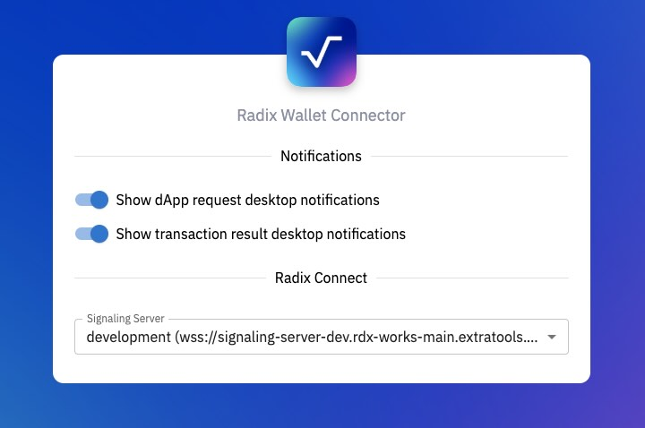
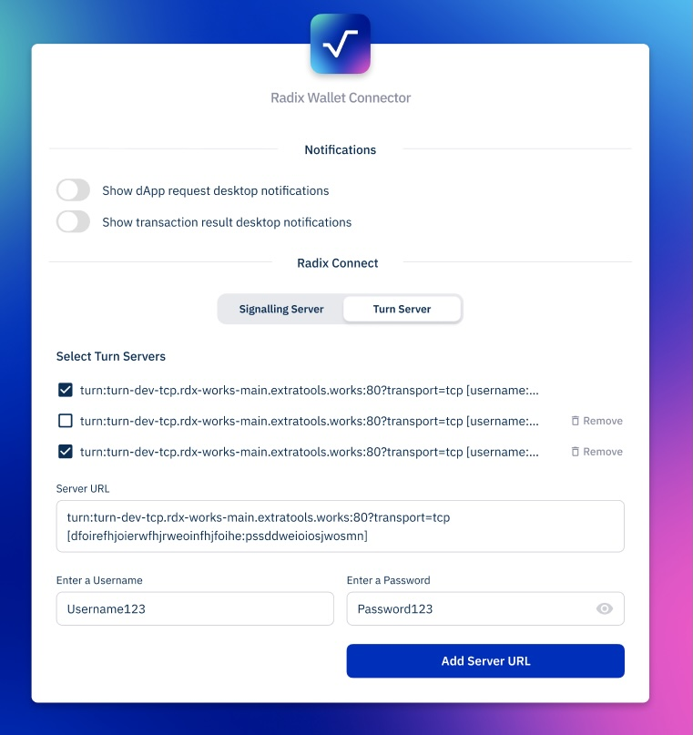
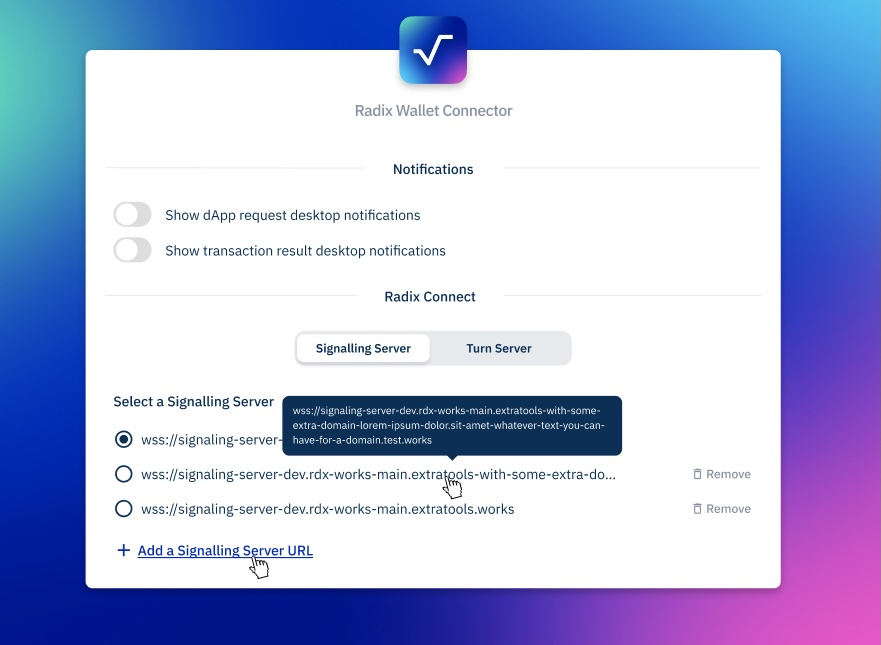

# Options

## Notifications

User can decide if he wants notifications or not

## Radix Connect

This section in CE settings is not implemented yet. The intention is to allow people to customly define their [signaling server](https://github.com/radixdlt/signaling-server)

