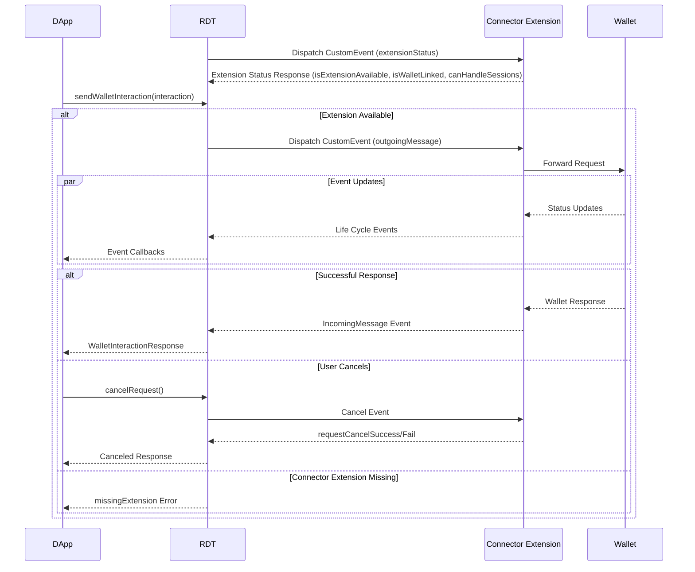
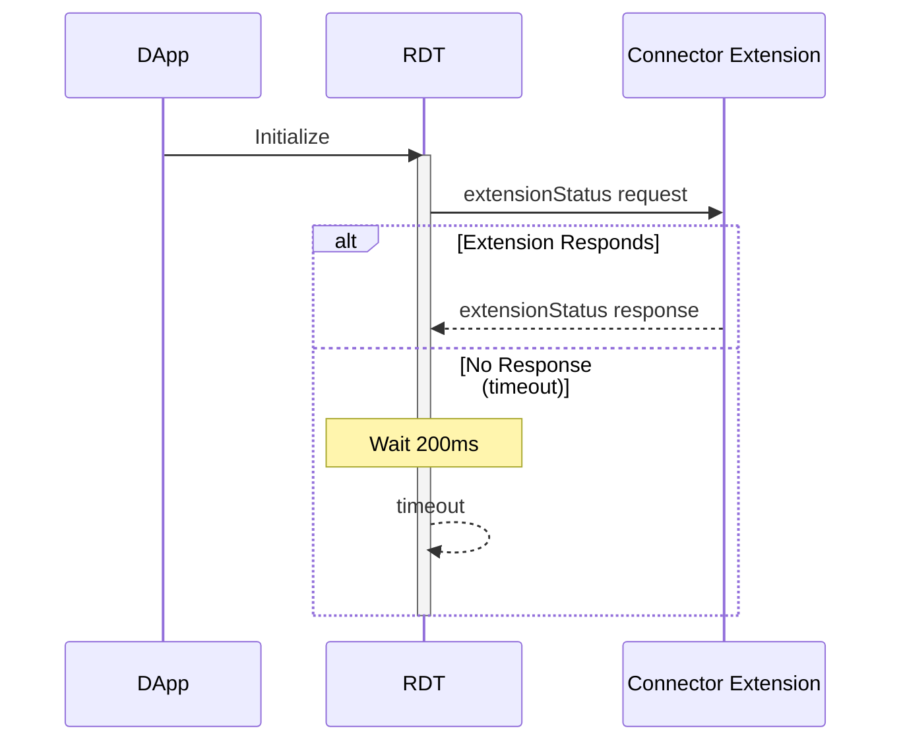

[](LICENSE) [](https://sonarcloud.io/project/overview?id=radixdlt_babylon-browser-extension)

# Connector Extension

Chrome Web Store Links
 - [Beta version](https://chromewebstore.google.com/detail/radix-wallet-connector-be/mllkalekmdemcgbgblidfgknmokombof) 
 - [Prod version](https://chromewebstore.google.com/detail/radix-wallet-connector/bfeplaecgkoeckiidkgkmlllfbaeplgm)

## Prerequisites

- Node.js >=18
- npm

## Installation

```bash
# Install dependencies
npm install
```

## Development

```bash
# Start development server with hot module reload
npm start
```

1. Starting the dev server will output a `dist` folder.
2. Go to `chrome://extensions`
3. Enable `developer mode` in top right corner
4. Import the unpacked extension
   1. drag and drop the dist folder
   2. or click load unpacked and import using the file system

## Building

```bash
# Build with development tools 
npm run build:dev

# Build production version (without dev tools)
npm run build
```

## Internal modules

The connector extension is composed of the following:

- [content script](https://developer.chrome.com/docs/extensions/develop/concepts/content-scripts)
- [background worker](https://developer.chrome.com/docs/workbox/service-worker-overview?hl=en)
- [offscreen page](https://developer.chrome.com/docs/extensions/reference/api/offscreen?hl=en)
- [UI](https://developer.chrome.com/docs/extensions/reference/api/windows#description)
  - wallet pairing - [pairing](/docs/pairing.md)
  - ledger connection - [ledger docs](/docs/ledger.md)
  - options - [options docs](/docs/options.md)
  - development tools [dev tools docs](/docs/dev-tools.md)

## Debug

To access the background worker and offscreen page go to `chrome://extensions` and click on `Details`


Find `Inspect views` section


#### Exporting logs

1. Right click on the Connector Extension icon in chrome extension toolbar
2. Export Logs


# dApp Toolkit <> Connector Extension API



## Communication Channel

Uses browser events for bidirectional communication

### **dApp → Extension (`outgoingMessage`)**

- event name: `radix#chromeExtension#send`

**Send example**

```javascript
window.dispatchEvent(
  new CustomEvent('radix#chromeExtension#send', {
    detail: { DAPP_TOOLKIT_MESSAGE },
  }),
)
```

**Listen example**

```javascript
window.addEventListener('radix#chromeExtension#send', (event) => {
  const message = event.detail
})
```

### **Extension → dApp (`incomingMessage`)**

- event name: `radix#chromeExtension#receive`

**Send example**

```javascript
window.dispatchEvent(
  new CustomEvent('radix#chromeExtension#receive', {
    detail: {...}
  })
)
```

**Listen example**

```javascript
window.addEventListener('radix#chromeExtension#receive', (event) => {
  const message = event.detail
})
```

## dApp → Extension messages

- `Status` – Check if extension is available
- `OpenPopup` – Open extension popup, used for displaying QR-code containing linking data
- `WalletInteraction` – Contains a wallet interaction message
- `CancelWalletInteraction` – Cancels wallet interaction that is in-flight

### Status



**Request**

- interactionId: UUID v4
- discriminator: `extensionStatus`

**Response**

_Note: a response must be received within 200ms, otherwise it’s considered unavailable_

- `eventType`: extensionStatus

- `isWalletLinked`: A boolean flag that indicates whether the Connector Extension has an link to a Radix Wallet.

- `isExtensionAvailable`: A boolean flag that indicates that if the connector extension is available
- `canHandleSessions`: Optional boolean flag indicating session support

Example

```javascript
{
  eventType: 'extensionStatus',
  interactionId: '3869e88d-3a4d-42a6-8a71-df9647d22380',
  isWalletLinked: true,
  isExtensionAvailable: true,
  canHandleSessions: true
}
```

### OpenPopup

**Request**

- interactionId: UUID v4
- discriminator: `openPopup`

**Response**

no response is sent back

### WalletInteraction

**Request**

- interactionId: UUID v4
- discriminator: `walletInteraction`
- interaction: WalletInteraction
- Optional sessionId: UUID v4

**Response**

WalletInteractionResponse

### CancelWalletInteraction

**Request**

- interactionId: UUID v4
- discriminator: `cancelWalletInteraction`

**Response**

One of:

1. RequestCancelSuccess
   - interactionId: UUID v4
   - eventType: `requestCancelSuccess`
2. RequestCancelFail
   - interactionId: UUID v4
   - eventType: `requestCancelFail`

## Extension → dApp messages

### Request life-cycle events

Messages sent by extension to report back status on in-flight wallet interactions.

#### receivedByExtension

- interactionId: UUID v4
- eventType: `receivedByExtension`

#### receivedByWallet

- interactionId: UUID v4
- eventType: `receivedByWallet`

# More resources
- [Offscreen Page Communication with Wallet](./docs/offscreen.md)

# License

The Radix Connector Extension binaries are licensed under the [Radix Software EULA](http://www.radixdlt.com/terms/genericEULA).

The Radix Connector Extension code is released under the [Apache 2.0 license](./LICENSE).

      Copyright 2023 Radix Publishing Ltd

      Licensed under the Apache License, Version 2.0 (the "License"); you may not use this file except in compliance with the License.

      You may obtain a copy of the License at: http://www.apache.org/licenses/LICENSE-2.0

      Unless required by applicable law or agreed to in writing, software distributed under the License is distributed on an "AS IS" BASIS, WITHOUT WARRANTIES OR CONDITIONS OF ANY KIND, either express or implied.

      See the License for the specific language governing permissions and limitations under the License.
